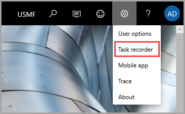

---
lab:
    title: 'MB-300.0 Practice Lab： Module 13'
    module: 'Module 13'
---

# Exercise - Build test scripts to test business functionality

When you have created a Business Process Modeler (BPM) library, you'll need to use Task recorder to create your test cases and then upload the cases to BPM. 

**Before you begin**

To get the most benefit from this exercise, we recommend that you have the standard sample data available in Finance and Operations apps installed by using Lifecycle Services (LCS).

**Create a BPM library**

1. In [LCS](https://lcs.dynamics.com/V2/), navigate to your project. In the tiles on the right, select **Business process modeler**. Click that, and on the **Business process libraries** page, select **New library**.

2. Enter **Training First** for the new library name and then select **Create**. 

**Add a new process**

3. In the BPM library, select **Training First**.

4. Highlight the process **Sample Core Business Process** and select **Add process**. You can select to add the process as a child or a sibling of the selected process node. In this way, you can create a semantic hierarchy of business processes. Choose **As child**.

**Edit the properties of the process**

5. In the BPM library, select the process node to edit: **New business process**.

6. On the right pane, on the **Overview** tab, select **Edit mode**.

7. Enter a name and description for the process node:

	- Name: **Create a sales order**

	- Description: **This process documents the creation of a sales order.**

8. Optionally, select the industries and the countries or regions that the process applies to. You can also add keywords and links. Keywords let you define categories, work streams, or other metadata. Links (URLs) let you reference external sites or documentation.

9. When you've finished editing the properties, select **Save**.

**Copy a library**

You may have need to copy a library, for example: for a variation. This task illustrates how it’s done.

10. Open the **Business process libraries** page via the Business process modeler tile on the project page on LCS.

11. On the tile for **Training first**, as the library that you want to copy, select the ellipsis button (...) and then select **Copy**. 

12. Enter a name for the library **Training Second** and then select **Create**. 

**Add a new child process**

13. In the **Training Second** library, select the existing process Create a sales order. You may do this by clicking the caret next to **Sample Core Business Process** and highlighting the **Create a sales order** line.

14. Select **Add process**. You can select to add the process as a child or a sibling of the selected process node. In this way, you can create a semantic hierarchy of business processes. Select **As child**.

**Edit the properties of the process**

15. On the right pane, on the **Overview** tab, select **Edit mode**.

16. Enter a name and description for the process node:

	- Name: **Create a sales line**

	- Description: **This process creates a line for the parent sales order.**

17. When you've finished editing the properties, select **Save**.

**Record test cases and save to BPM**

18. Open the Finance and Operations apps client and sign in.

19. Verify that you are in the company that you want to use while recording: **USMF**.

20. Go to **Settings &gt; Task recorder**.  
	

21. Select **Create recording**.

22. Enter a name for the recording: **Sales order creation** and then select **Start**. Recording begins the moment that you select **Start**.

	1. Navigate to **Modules &gt; Accounts receivable &gt; Orders &gt; All sales orders**

	2. Click **New**.

	3. Enter sales order options:

		1. For Customer, type **US-001**

	4. Select **OK**.

	5. Enter line:

		1. For Item, type **A0001**

		2. For Site, type **1**

		3. Allow the remaining values to default

	6. Select **Save**, and Close via the **X**.

23. When the task is complete, on the Task recorder pane, select **Stop**.

24. To save the task recording to an attached BPM, select **Save to Lifecycle Services**.

	1. If you haven’t connected to Lifecycle Services yet, now is the time to establish a connection. Select **Click here to connect to Lifecycle Services**.

	2. You should be brought to a browser tab saying that you were successful. You may close the tab.

	3. Return to your Finance and Operations screen and select **OK**.

25. Select the library that you want to save the recording to, which will have the name **Training Second**, and the process **Create a sales order**, then select **OK**.

### Alternate method – save locally, then upload

26. Or, select **Save to this PC**. Complete the save process of the .axtr.

27. Open or return to LCS, in your project, on the **Business process libraries** page, select the library to upload the task recording to.

28. Locate and select the process (**Create a sales order** under **Training Second**) to upload the task recording to.

29. On the right pane, select **Upload**.

30. Select **Browse** to find and select the .axtr file to upload, and then select **Upload**.

 
